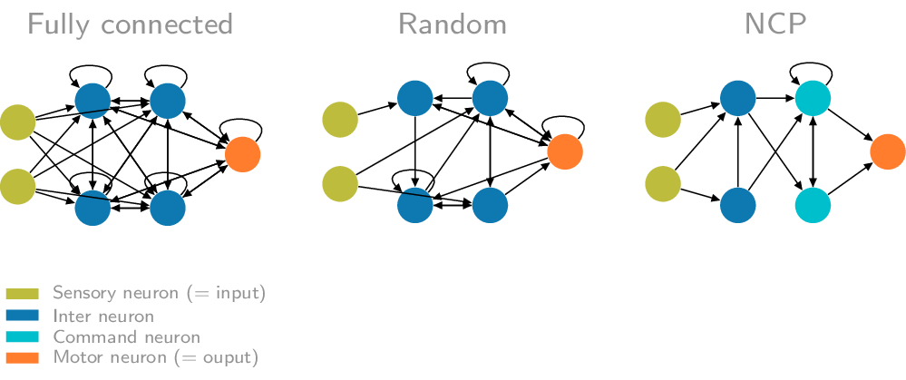

# Neural Circuit Policies Enabling Auditable Autonomy

[](https://zenodo.org/badge/latestdoi/290199641)

[Online access via SharedIt](https://rdcu.be/b8sEo)

Neural Circuit Policies (NCPs) are designed sparse recurrent neural networks based on the LTC neuron and synapse model loosely inspired by the nervous system of the organism [C. elegans](http://www.wormbook.org/chapters/www_celegansintro/celegansintro.html). 
This page is a description of the Keras (TensorFlow 2.0 package) reference implementation of NCPs.
For reproducibility materials of the paper see [the corresponding subpage](https://github.com/mlech26l/keras-ncp/tree/master/reproducibility/README.md).



## Installation

Requirements:

- Python 3.6
- TensorFlow 2.0

```bash
pip install keras-ncp
```

## Colab notebooks

We have created a few Google Colab notebooks for an interactive introduction to the package

- [Google Colab: Basic usage](https://colab.research.google.com/drive/1IvVXVSC7zZPo5w-PfL3mk1MC3PIPw7Vs?usp=sharing)
- [Google Colab: Stacking NCPs with other layers](https://colab.research.google.com/drive/1-mZunxqVkfZVBXNPG0kTSKUNQUSdZiBI?usp=sharing)

## Usage: the basics

The package is composed of two main parts: 

- The LTC model as a ```tf.keras.layers.Layer``` RNN cell.
- An wiring architecture for the LTC cell above

The wiring could be fully-connected (all-to-all) or sparsely designed using the NCP principles introduced in the paper.
As the LTC model is expressed in the form of a system of [ordinary differential equations in time](https://arxiv.org/abs/2006.04439), any instance of it is inherently a recurrent neural network (RNN).

Let's create a LTC network consisting of 8 fully-connected neurons that receive a time-series of 2 input features as input. Moreover, we define that 1 of the 8 neurons acts as the output (=motor neuron):

```python
from tensorflow import keras
import kerasncp as kncp

wiring = kncp.wirings.FullyConnected(8, 1)  # 8 units, 1 motor neuron
ltc_cell = kncp.LTCCell(wiring) # Create LTC model

model = keras.Sequential(
    [
        keras.layers.InputLayer(input_shape=(None, 2)), # 2 input features
        keras.layers.RNN(ltc_cell, return_sequences=True),
    ]
)
model.compile(
    optimizer=keras.optimizers.Adam(0.01), loss='mean_squared_error'
)

```


We can then fit this model to a generated sine wave, as outlined in the tutorials ([open in Google Colab](https://colab.research.google.com/drive/1IvVXVSC7zZPo5w-PfL3mk1MC3PIPw7Vs?usp=sharing)).


## More complex architectures

We can also create some more complex NCP wiring architecture. 
Simply put, an NCP is a 4-layer design vaguely inspired by the wiring of the [C. elegans worm](https://wormwiring.org/). The four layers are sensory, inter, command, and motor layer, which are sparsely connected in a feed-forward fashion. On top of that, the command layer realizes some recurrent connections. As their names already indicate, the sensory represents the input and the motor layer the output of the network.

We can also customize some of the parameter initalization ranges, although the default values should work fine for most cases.
```python
ncp_wiring = kncp.wirings.NCP(
    inter_neurons=20,  # Number of inter neurons
    command_neurons=10,  # Number of command neurons
    motor_neurons=5,  # Number of motor neurons
    sensory_fanout=4,  # How many outgoing synapses has each sensory neuron
    inter_fanout=5,  # How many outgoing synapses has each inter neuron
    recurrent_command_synapses=6,  # Now many recurrent synapses are in the
    # command neuron layer
    motor_fanin=4,  # How many incomming syanpses has each motor neuron
)
ncp_cell = kncp.LTCCell(
    ncp_wiring,
    initialization_ranges={
        # Overwrite some of the initalization ranges
        "w": (0.2, 2.0),
    },
)
```

We can then combine the NCP cell with arbitary ```keras.layers```, for instance to build a powerful image sequence classifier:

```python
height, width, channels = (78, 200, 3)

model = keras.models.Sequential(
    [
        keras.layers.InputLayer(input_shape=(None, height, width, channels)),
        keras.layers.TimeDistributed(
            keras.layers.Conv2D(32, (5, 5), activation="relu")
        ),
        keras.layers.TimeDistributed(keras.layers.MaxPool2D()),
        keras.layers.TimeDistributed(
            keras.layers.Conv2D(64, (5, 5), activation="relu")
        ),
        keras.layers.TimeDistributed(keras.layers.MaxPool2D()),
        keras.layers.TimeDistributed(keras.layers.Flatten()),
        keras.layers.TimeDistributed(keras.layers.Dense(32, activation="relu")),
        keras.layers.RNN(ncp_cell, return_sequences=True),
        keras.layers.TimeDistributed(keras.layers.Activation("softmax")),
    ]
)
model.compile(
    optimizer=keras.optimizers.Adam(0.01),
    loss='sparse_categorical_crossentropy',
)
```

```bib
@article{lechner2020neural,
  title={Neural circuit policies enabling auditable autonomy},
  author={Lechner, Mathias and Hasani, Ramin and Amini, Alexander and Henzinger, Thomas A and Rus, Daniela and Grosu, Radu},
  journal={Nature Machine Intelligence},
  volume={2},
  number={10},
  pages={642--652},
  year={2020},
  publisher={Nature Publishing Group}
}
```
