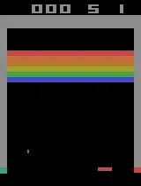

Atari Reinforcement Learning (PPO)
================================================

In this guide, we will train an NCP to play Atari through Reinforcement Learning.
Code is provided for TensorFlow and relies on `ray[rllib] <https://docs.ray.io/en/latest/rllib/index.html>`_ for the learning.
The specific RL algorithm we are using is `proximal policy optimization (PPO) <https://arxiv.org/abs/1707.06347>`_
which is a good baseline that works for both discrete and continuous action space environments.

Setup and Requirements
-------------------------------------
Before we start, we need to install some packages

.. code-block:: bash

    pip3 install ncps tensorflow "ale-py==0.7.4" "ray[rllib]==2.1.0" "gym[atari,accept-rom-license]==0.23.1"

Defining the model
-------------------------------------
First, we will define the neural network model.
The model consists of a convolutional block, followed by a CfC recurrent neural network.
To make our model compatible with rllib we have to subclass from ``ray.rllib.models.tf.recurrent_net.RecurrentNetwork``.

Our Conv-CfC network has two output tensors:

* A distribution of the possible actions (= the policy)
* A scalar estimation of the value function

The second output is a necessity of the PPO RL algorithms we are using. Learning both, the policy and the value function,
in a single network often has some learning advantages of having shared features.

.. code-block:: python

    import numpy as np
    from ray.rllib.models.modelv2 import ModelV2
    from ray.rllib.models.tf.recurrent_net import RecurrentNetwork
    from ray.rllib.utils.annotations import override
    import tensorflow as tf
    from ncps.tf import CfC

    class ConvCfCModel(RecurrentNetwork):
        """Example of using the Keras functional API to define a RNN model."""

        def __init__(
            self,
            obs_space,
            action_space,
            num_outputs,
            model_config,
            name,
            cell_size=64,
        ):
            super(ConvCfCModel, self).__init__(
                obs_space, action_space, num_outputs, model_config, name
            )
            self.cell_size = cell_size

            # Define input layers
            input_layer = tf.keras.layers.Input(
                # rllib flattens the input
                shape=(None, obs_space.shape[0] * obs_space.shape[1] * obs_space.shape[2]),
                name="inputs",
            )
            state_in_h = tf.keras.layers.Input(shape=(cell_size,), name="h")
            seq_in = tf.keras.layers.Input(shape=(), name="seq_in", dtype=tf.int32)

            # Preprocess observation with a hidden layer and send to CfC
            self.conv_block = tf.keras.models.Sequential([
                tf.keras.Input(
                    (obs_space.shape[0] * obs_spac.shapee[1] * obs_space.shape[2])
                ),  # batch dimension is implicit
                tf.keras.layers.Lambda(
                    lambda x: tf.cast(x, tf.float32) / 255.0
                ),  # normalize input
                # unflatten the input image that has been done by rllib
                tf.keras.layers.Reshape((obs_space.shape[0], obs_space.shape[1], obs_space.shape[2])),
                tf.keras.layers.Conv2D(
                    64, 5, padding="same", activation="relu", strides=2
                ),
                tf.keras.layers.Conv2D(
                    128, 5, padding="same", activation="relu", strides=2
                ),
                tf.keras.layers.Conv2D(
                    128, 5, padding="same", activation="relu", strides=2
                ),
                tf.keras.layers.Conv2D(
                    256, 5, padding="same", activation="relu", strides=2
                ),
                tf.keras.layers.GlobalAveragePooling2D(),
            ])
            self.td_conv = tf.keras.layers.TimeDistributed(self.conv_block)

            dense1 = self.td_conv(input_layer)
            cfc_out, state_h = CfC(
                cell_size, return_sequences=True, return_state=True, name="cfc"
            )(
                inputs=dense1,
                mask=tf.sequence_mask(seq_in),
                initial_state=[state_in_h],
            )

            # Postprocess CfC output with another hidden layer and compute values
            logits = tf.keras.layers.Dense(
                self.num_outputs, activation=tf.keras.activations.linear, name="logits"
            )(cfc_out)
            values = tf.keras.layers.Dense(1, activation=None, name="values")(cfc_out)

            # Create the RNN model
            self.rnn_model = tf.keras.Model(
                inputs=[input_layer, seq_in, state_in_h],
                outputs=[logits, values, state_h],
            )
            self.rnn_model.summary()

        @override(RecurrentNetwork)
        def forward_rnn(self, inputs, state, seq_lens):
            model_out, self._value_out, h = self.rnn_model([inputs, seq_lens] + state)
            return model_out, [h]

        @override(ModelV2)
        def get_initial_state(self):
            return [
                np.zeros(self.cell_size, np.float32),
            ]

        @override(ModelV2)
        def value_function(self):
            return tf.reshape(self._value_out, [-1])

Once we have defined out model, we can register it in rllib:

.. code-block:: python

    from ray.rllib.models import ModelCatalog

    ModelCatalog.register_custom_model("cfc", ConvCfCModel)

Defining the RL algorithm and its hyperparameters
-------------------------------------------------------

Every RL algorithm relies on dozen of hyperparameters that can have a huge effect on the learning performance.
PPO is no exception to this rule.
Luckily, the rllib authors have provided a `configuration that works decently for PPO with Atari environments <https://github.com/ray-project/ray/blob/master/rllib/tuned_examples/ppo/atari-ppo.yaml>`_,
which we will make use of.

.. code-block:: python

    import argparse
    import os
    import gym
    from ray.tune.registry import register_env
    from ray.rllib.algorithms.ppo import PPO
    import time
    import ale_py
    from ray.rllib.env.wrappers.atari_wrappers import wrap_deepmind

    if __name__ == "__main__":
        parser = argparse.ArgumentParser()
        parser.add_argument("--env", type=str, default="ALE/Breakout-v5")
        parser.add_argument("--cont", default="")
        parser.add_argument("--render", action="store_true")
        parser.add_argument("--hours", default=4, type=int)
        args = parser.parse_args()

        register_env("atari_env", lambda env_config: wrap_deepmind(gym.make(args.env)))
        config = {
            "env": "atari_env",
            "preprocessor_pref": None,
            "gamma": 0.99,
            "num_gpus": 1,
            "num_workers": 16,
            "num_envs_per_worker": 4,
            "create_env_on_driver": True,
            "lambda": 0.95,
            "kl_coeff": 0.5,
            "clip_rewards": True,
            "clip_param": 0.1,
            "vf_clip_param": 10.0,
            "entropy_coeff": 0.01,
            "rollout_fragment_length": 100,
            "sgd_minibatch_size": 500,
            "num_sgd_iter": 10,
            "batch_mode": "truncate_episodes",
            "observation_filter": "NoFilter",
            "model": {
                "vf_share_layers": True,
                "custom_model": "cfc",
                "max_seq_len": 20,
                "custom_model_config": {
                    "cell_size": 64,
                },
            },
            "framework": "tf2",
        }

        algo = PPO(config=config)

When running the algorithm, we will create checkpoints which we can restore later on.
We will store these checkpoints in the folder ``rl_ckpt`` and add the ability to restore a specific checkpoint id via the ``--cont`` argument.

.. code-block:: python

    os.makedirs(f"rl_ckpt/{args.env}", exist_ok=True)
    if args.cont != "":
        algo.load_checkpoint(f"rl_ckpt/{args.env}/checkpoint-{args.cont}")

Visualizing the policy-environment interaction
-------------------------------------------------------

To later on visualize how the trained policy is playing the Atari game, we have to write a function
that enables the ``render_mode`` of the environment and executes the policy in a closed-loop.

For computing the actions we use the ``compute_single_action`` function of the algorithm object, but we have to take
care of the RNN hidden state initialization ourselves.

.. code-block:: python

    def run_closed_loop(algo, config):
        env = gym.make(args.env, render_mode="human")
        env = wrap_deepmind(env)
        rnn_cell_size = config["model"]["custom_model_config"]["cell_size"]
        obs = env.reset()
        state = init_state = [np.zeros(rnn_cell_size, np.float32)]
        while True:
            action, state, _ = algo.compute_single_action(
                obs, state=state, explore=False, policy_id="default_policy"
            )
            obs, reward, done, _ = env.step(action)
            if done:
                obs = env.reset()
                state = init_state

Running PPO
-------------------------------------------------------

Finally, we can run the RL algorithm.
Particularly, we branch depending on the ``--render`` argument whether to train the policy or visualize it.

.. code-block:: python

    if args.render:
        run_closed_loop(
            algo,
            config,
        )
    else:
        start_time = time.time()
        last_eval = 0
        while True:
            info = algo.train()
            if time.time() - last_eval > 60 * 5:  # every 5 minutes print some stats
                print(f"Ran {(time.time()-start_time)/60/60:0.1f} hours")
                print(
                    f"    sampled {info['info']['num_env_steps_sampled']/1000:0.0f}k steps"
                )
                print(f"    policy reward: {info['episode_reward_mean']:0.1f}")
                last_eval = time.time()
                ckpt = algo.save_checkpoint(f"rl_ckpt/{args.env}")
                print(f"    saved checkpoint '{ckpt}'")

            elapsed = (time.time() - start_time) / 60  # in minutes
            if elapsed > args.hours * 60:
                break

The full source code can be found `here <https://github.com/mlech26l/ncps/blob/master/examples/atari_ppo.py>`_.

.. note::
    On a modern desktop machine, it takes about an hour to get to a return of 20, and about 4 hours to reach a return of 50.

.. warning::
    For Atari environments rllib distinguishes between the episodic (1 life) and the game (3 lives) return, thus the return reported by rllib may differ from the return achieved in the closed-loop evaluation.

The output of the full script is something like:

.. code-block:: text

    > Ran 0.0 hours
    >     sampled 4k steps
    >     policy reward: nan
    >     saved checkpoint 'rl_ckpt/ALE/Breakout-v5/checkpoint-1'
    > Ran 0.1 hours
    >     sampled 52k steps
    >     policy reward: 1.9
    >     saved checkpoint 'rl_ckpt/ALE/Breakout-v5/checkpoint-13'
    > Ran 0.2 hours
    >     sampled 105k steps
    >     policy reward: 2.6
    >     saved checkpoint 'rl_ckpt/ALE/Breakout-v5/checkpoint-26'
    > Ran 0.3 hours
    >     sampled 157k steps
    >     policy reward: 3.4
    >     saved checkpoint 'rl_ckpt/ALE/Breakout-v5/checkpoint-39'
    > Ran 0.4 hours
    >     sampled 210k steps
    >     policy reward: 6.7
    >     saved checkpoint 'rl_ckpt/ALE/Breakout-v5/checkpoint-52'
    > Ran 0.4 hours
    >     sampled 266k steps
    >     policy reward: 8.7
    >     saved checkpoint 'rl_ckpt/ALE/Breakout-v5/checkpoint-66'
    > Ran 0.5 hours
    >     sampled 323k steps
    >     policy reward: 10.5
    >     saved checkpoint 'rl_ckpt/ALE/Breakout-v5/checkpoint-80'
    > Ran 0.6 hours
    >     sampled 379k steps
    >     policy reward: 10.7
    >     saved checkpoint 'rl_ckpt/ALE/Breakout-v5/checkpoint-94'
    ...