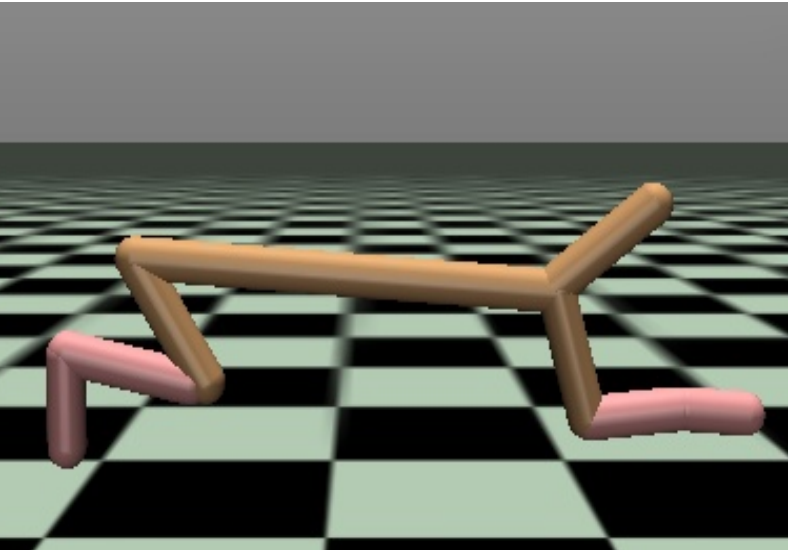
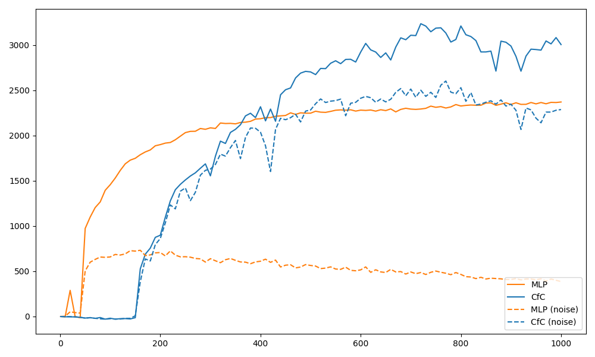

Partially Observabily Reinforcement Learning
================================================

In this guide, we will train a CfC network to solve a partially observable Markov decision process (POMDP).
In particular, we consider a partially observable version of the `HalfCheetah Mujoco environment <https://gymnasium.farama.org/environments/mujoco/half_cheetah/>`_. 
Moreover, we will also evalute the trained policy when the observation is corrupted by noise to test the robustness of the learned policy.
This tutorial serves as a beginner's guide to using CfC networks in reinforcement learning, 
showing how to define a custom CfC network and how to use it with `rllib <https://docs.ray.io/en/latest/rllib/index.html>`_, as well as
demonstrating the the advantages of RNNs in partially observable environments.

Code is provided for TensorFlow and relies on `ray[rllib] <https://docs.ray.io/en/latest/rllib/index.html>`_ for it's `proximal policy optimization (PPO) <https://arxiv.org/abs/1707.06347>`_
implementation and `gymnasium[mujoco] <https://gymnasium.farama.org/environments/mujoco/>`_ for the HalfCheetah environment.

Setup and Requirements
-------------------------------------
Before we start, we need to install some packages

.. code-block:: bash

    pip3 install ncps tensorflow "ray[rllib]" "gymnasium[mujoco]"

Partially Observable HalfCheetah
-------------------------------------
First, we need to create a partially observable version of the HalfCheetah environment.
We do this by wrapping the original environment in a ``gymnasium.ObservationWrapper``

.. code-block:: python

    import gymnasium
    from gymnasium import spaces

    import ray
    from ray.tune.registry import register_env
    from ray.rllib.models import ModelCatalog
    from ray.rllib.algorithms.ppo import PPO
    import time
    import numpy as np

    from ray.rllib.models.modelv2 import ModelV2
    from ray.rllib.models.tf.recurrent_net import RecurrentNetwork
    from ray.rllib.utils.annotations import override

    import tensorflow as tf
    import ncps.tf

    import matplotlib.pyplot as plt

    class PartialObservation(gymnasium.ObservationWrapper):
        def __init__(self, env: gymnasium.Env, obs_indices: list):
            gymnasium.ObservationWrapper.__init__(self, env)

            obsspace = env.observation_space
            self.obs_indices = obs_indices
            self.observation_space = spaces.Box(
                low=np.array([obsspace.low[i] for i in obs_indices]),
                high=np.array([obsspace.high[i] for i in obs_indices]),
                dtype=np.float32,
            )

            self._env = env

        def observation(self, observation):
            filter_observation = self._filter_observation(observation)
            return filter_observation

        def _filter_observation(self, observation):
            observation = np.array([observation[i] for i in self.obs_indices])
            return observation

Concretely, we will remove all joint velcities from the observation space.

.. code-block:: python

    def make_partial_observation_cheetah():
        return PartialObservation(
            gymnasium.make("HalfCheetah-v4"), [0, 1, 2, 3, 8, 9, 10, 11, 12]
        )

CfC Policy Network
-------------------------------------

Next, we will subclass ``ray.rllib.models.tf.recurrent_net.RecurrentNetwork`` to define our CfC policy network.
The network comprises of two dense layers followed by a CfC layer.

.. code-block:: python

    class CustomRNN(RecurrentNetwork):
        """Example of using the Keras functional API to define a RNN model."""

        def __init__(
            self,
            obs_space,
            action_space,
            num_outputs,
            model_config,
            name,
            cell_size=64,
        ):
            super(CustomRNN, self).__init__(
                obs_space, action_space, num_outputs, model_config, name
            )
            self.cell_size = cell_size

            # Define input layers
            input_layer = tf.keras.layers.Input(
                shape=(None, obs_space.shape[0]),
                name="inputs",
            )
            state_in_h = tf.keras.layers.Input(shape=(cell_size,), name="h")
            seq_in = tf.keras.layers.Input(shape=(), name="seq_in", dtype=tf.int32)

            # Preprocess observation with a hidden layer and send to RNN
            self.preprocess_layers = tf.keras.models.Sequential(
                [
                    tf.keras.Input((obs_space.shape[0],)),  # batch dimension is implicit
                    tf.keras.layers.Dense(256, activation="silu"),
                    tf.keras.layers.Dense(256, activation="silu"),
                ]
            )
            self.td_preprocess = tf.keras.layers.TimeDistributed(self.preprocess_layers)

            dense1 = self.td_preprocess(input_layer)
            rnn_out, state_h = ncps.tf.CfC(
                cell_size, return_sequences=True, return_state=True, name="rnn"
            )(
                inputs=dense1,
                mask=tf.sequence_mask(seq_in),
                initial_state=[state_in_h],
            )
            logits = tf.keras.layers.Dense(
                self.num_outputs, activation=None, name="logits"
            )(rnn_out)
            values = tf.keras.layers.Dense(1, activation=None, name="values")(rnn_out)

            # Create the RNN model
            self.rnn_model = tf.keras.Model(
                inputs=[input_layer, seq_in, state_in_h],
                outputs=[logits, values, state_h],
            )
            self.rnn_model.summary()

        @override(RecurrentNetwork)
        def forward_rnn(self, inputs, state, seq_lens):
            model_out, self._value_out, h = self.rnn_model([inputs, seq_lens] + state)
            return model_out, [h]

        @override(ModelV2)
        def get_initial_state(self):
            return [
                np.zeros(self.cell_size, np.float32),
            ]

        @override(ModelV2)
        def value_function(self):
            return tf.reshape(self._value_out, [-1])

Evaluate Function
-------------------------------------

Next, we will define a function that evaluates the performance of a policy network with optional noise injected to the observations.

.. note::
    Depending on the rllib version and installation the ``apply_filter`` may be already included in the ``compute_single_action`` function.

.. code-block:: python

    def run_closed_loop(
        algo, rnn_cell_size, n_episodes=10, pertubation_level=0.0, apply_filter=True
    ):
        env = make_partial_observation_cheetah()
        init_state = None
        state = None
        if rnn_cell_size is not None:
            state = init_state = [np.zeros(rnn_cell_size, np.float32)]
        obs, info = env.reset()
        ep = 0
        ep_rewards = []
        reward = 0
        while ep < n_episodes:
            if pertubation_level > 0.0:
                obs = obs + np.random.default_rng().normal(0, pertubation_level, obs.shape)

            if apply_filter:
                filter = algo.workers.local_worker().filters.get("default_policy")
                obs = filter(obs, update=False)

            if rnn_cell_size is None:
                action = algo.compute_single_action(
                    obs, explore=False, policy_id="default_policy"
                )
            else:
                action, state, _ = algo.compute_single_action(
                    obs, state=state, explore=False, policy_id="default_policy"
                )
            obs, r, terminated, truncated, info = env.step(action)
            reward += r
            if terminated or truncated:
                ep += 1
                obs, info = env.reset()
                state = init_state
                ep_rewards.append(reward)
                reward = 0
        return np.mean(ep_rewards)

Training Code
-------------------------------------

Finally, we will define a function that trains a policy network.
To compare the performance of the CfC policy network with a baseline, we will make the function such that 
it can train a CfC policy network or an MLP baseline policy network.

.. code-block:: python

    def run_algo(model_name, num_iters):
        config = {
            "env": "my_env",
            "gamma": 0.99,
            "num_gpus": 1,
            "num_workers": 16,
            "num_envs_per_worker": 4,
            "lambda": 0.95,
            "kl_coeff": 1.0,
            "num_sgd_iter": 64,
            "lr": 0.0005,
            "vf_loss_coeff": 0.5,
            "clip_param": 0.1,
            "sgd_minibatch_size": 4096,
            "train_batch_size": 65536,
            "grad_clip": 0.5,
            "batch_mode": "truncate_episodes",
            "observation_filter": "MeanStdFilter",
            "framework": "tf",
        }
        rnn_cell_size = None
        if model_name == "cfc_rnn":
            rnn_cell_size = 64
            config["model"] = {
                "vf_share_layers": True,
                "custom_model": "cfc_rnn",
                "custom_model_config": {
                    "cell_size": rnn_cell_size,
                },
            }
        elif model_name == "default":
            pass
        else:
            raise ValueError(f"Unknown model type {model_name}")

        algo = PPO(config=config)
        history = {"reward": [], "reward_noise": [], "iteration": []}
        for iteration in range(1, num_iters + 1):
            algo.train()
            if iteration % 10 == 0 or iteration == 1:
                history["iteration"].append(iteration)
                history["reward"].append(run_closed_loop(algo, rnn_cell_size))
                history["reward_noise"].append(
                    run_closed_loop(algo, rnn_cell_size, pertubation_level=0.1)
                )
                print(
                    f"{model_name} iteration {iteration}: {history['reward'][-1]:0.2f}, with noise: {history['reward_noise'][-1]:0.2f}"
                )
        return history

.. note::

    Exact learning curves and performance numbers will vary between runs.

Once we have defined everything we can compare the two network architectures.

.. code-block:: python

    if __name__ == "__main__":
        ModelCatalog.register_custom_model("cfc_rnn", CustomRNN)
        register_env("my_env", lambda env_config: make_partial_observation_cheetah())
        ray.init(num_cpus=24, num_gpus=1)
        cfc_result = run_algo("cfc_rnn", 1000)
        ray.shutdown()
        ModelCatalog.register_custom_model("cfc_rnn", CustomRNN)
        register_env("my_env", lambda env_config: make_partial_observation_cheetah())
        ray.init(num_cpus=24, num_gpus=1)
        mlp_result = run_algo("default", 1000)

        fig, ax = plt.subplots(figsize=(10, 6))
        ax.plot(
            mlp_result["iteration"], mlp_result["reward"], label="MLP", color="tab:orange"
        )
        ax.plot(
            cfc_result["iteration"], cfc_result["reward"], label="CfC", color="tab:blue"
        )
        ax.plot(
            mlp_result["iteration"],
            mlp_result["reward_noise"],
            label="MLP (noise)",
            color="tab:orange",
            ls="--",
        )
        ax.plot(
            cfc_result["iteration"],
            cfc_result["reward_noise"],
            label="CfC (noise)",
            color="tab:blue",
            ls="--",
        )
        ax.legend(loc="upper left")
        fig.tight_layout()
        plt.savefig("cfc_vs_mlp.png")

As we have see in the plot above, although the MLP baseline policy network experiences a faster initial improvement, 
the CfC policy network eventually outperforms the MLP baseline policy network, while also being more robust to noise.
