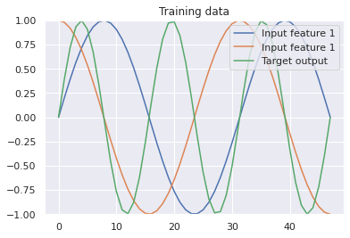
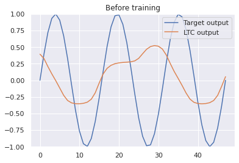
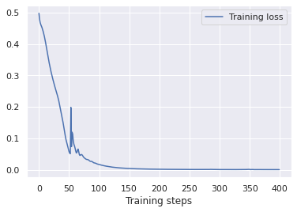
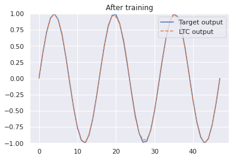

First steps (Pytorch)
================================================

In this tutorial we will build small NCP model based on the LTC neuron model and train it on some synthetic sinusoidal data.

.. code-block:: bash

    pip install seaborn ncps torch pytorch-lightning

.. code-block:: python

    import numpy as np
    import torch.nn as nn
    from ncps.wirings import AutoNCP
    from ncps.torch import LTC
    import pytorch_lightning as pl
    import torch
    import torch.utils.data as data

Generating synthetic sinusoidal training data
---------------------------------------------------

.. code-block:: python

    import matplotlib.pyplot as plt
    import seaborn as sns
    N = 48 # Length of the time-series
    # Input feature is a sine and a cosine wave
    data_x = np.stack(
        [np.sin(np.linspace(0, 3 * np.pi, N)), np.cos(np.linspace(0, 3 * np.pi, N))], axis=1
    )
    data_x = np.expand_dims(data_x, axis=0).astype(np.float32)  # Add batch dimension
    # Target output is a sine with double the frequency of the input signal
    data_y = np.sin(np.linspace(0, 6 * np.pi, N)).reshape([1, N, 1]).astype(np.float32)
    print("data_x.shape: ", str(data_x.shape))
    print("data_y.shape: ", str(data_y.shape))
    data_x = torch.Tensor(data_x)
    data_y = torch.Tensor(data_y)
    dataloader = data.DataLoader(
        data.TensorDataset(data_x, data_y), batch_size=1, shuffle=True, num_workers=4
    )

    # Let's visualize the training data
    sns.set()
    plt.figure(figsize=(6, 4))
    plt.plot(data_x[0, :, 0], label="Input feature 1")
    plt.plot(data_x[0, :, 1], label="Input feature 1")
    plt.plot(data_y[0, :, 0], label="Target output")
    plt.ylim((-1, 1))
    plt.title("Training data")
    plt.legend(loc="upper right")
    plt.show()


.. code-block:: text

    data_x.shape:  (1, 48, 2)
    data_y.shape:  (1, 48, 1)



Pytorch-Lightning RNN training module
-----------------------------------------

For training the model, we will use the pytorch-lightning high-level API. For that reason, we have to define a sequence learning module:

.. code-block:: python

    # LightningModule for training a RNNSequence module
    class SequenceLearner(pl.LightningModule):
        def __init__(self, model, lr=0.005):
            super().__init__()
            self.model = model
            self.lr = lr

        def training_step(self, batch, batch_idx):
            x, y = batch
            y_hat, _ = self.model.forward(x)
            y_hat = y_hat.view_as(y)
            loss = nn.MSELoss()(y_hat, y)
            self.log("train_loss", loss, prog_bar=True)
            return {"loss": loss}

        def validation_step(self, batch, batch_idx):
            x, y = batch
            y_hat, _ = self.model.forward(x)
            y_hat = y_hat.view_as(y)
            loss = nn.MSELoss()(y_hat, y)

            self.log("val_loss", loss, prog_bar=True)
            return loss

        def test_step(self, batch, batch_idx):
            # Here we just reuse the validation_step for testing
            return self.validation_step(batch, batch_idx)

        def configure_optimizers(self):
            return torch.optim.Adam(self.model.parameters(), lr=self.lr)

The LTC model with NCP wiring
------------------------------------------------

The ```ncps``` package is composed of two main parts:

- The LTC model as a ```nn.module``` object
- An wiring architecture for the LTC cell above

For the wiring we will use the ```AutoNCP`` class, which creates a NCP wiring diagram by providing the total number of neurons and the number of outputs (16 and 1 in our case).

.. note::

    Note that as the LTC model is expressed in the form of a system of [ordinary differential equations in time](https://arxiv.org/abs/2006.04439), any instance of it is inherently a recurrent neural network (RNN).
    That's why this simple example considers a sinusoidal time-series.

.. code-block:: python

    out_features = 1
    in_features = 2

    wiring = AutoNCP(16, out_features)  # 16 units, 1 motor neuron

    ltc_model = LTC(in_features, wiring, batch_first=True)
    learn = SequenceLearner(ltc_model, lr=0.01)
    trainer = pl.Trainer(
        logger=pl.loggers.CSVLogger("log"),
        max_epochs=400,
        gradient_clip_val=1,  # Clip gradient to stabilize training
    )

Draw the wiring diagram of the network
---------------------------------------------

.. code-block:: python

    sns.set_style("white")
    plt.figure(figsize=(6, 4))
    legend_handles = wiring.draw_graph(draw_labels=True, neuron_colors={"command": "tab:cyan"})
    plt.legend(handles=legend_handles, loc="upper center", bbox_to_anchor=(1, 1))
    sns.despine(left=True, bottom=True)
    plt.tight_layout()
    plt.show()


.. image:: ../img/examples/ncp_wiring.png
   :align: center

Visualizing the prediction of the network before training
---------------------------------------------------------------

.. code-block:: python

    # Let's visualize how LTC initialy performs before the training
    sns.set()
    with torch.no_grad():
        prediction = ltc_model(data_x)[0].numpy()
    plt.figure(figsize=(6, 4))
    plt.plot(data_y[0, :, 0], label="Target output")
    plt.plot(prediction[0, :, 0], label="NCP output")
    plt.ylim((-1, 1))
    plt.title("Before training")
    plt.legend(loc="upper right")
    plt.show()




Training the model
------------------------------

.. code-block:: python

    # Train the model for 400 epochs (= training steps)
    trainer.fit(learn, dataloader)


.. code-block:: text

    .... 1/1 [00:00<00:00, 4.91it/s, loss=0.000459, v_num=0, train_loss=0.000397]




.. code-block:: python


    # How does the trained model now fit to the sinusoidal function?
    sns.set()
    with torch.no_grad():
        prediction = ltc_model(data_x)[0].numpy()
    plt.figure(figsize=(6, 4))
    plt.plot(data_y[0, :, 0], label="Target output")
    plt.plot(prediction[0, :, 0], label="NCP output")
    plt.ylim((-1, 1))
    plt.title("After training")
    plt.legend(loc="upper right")
    plt.show()



