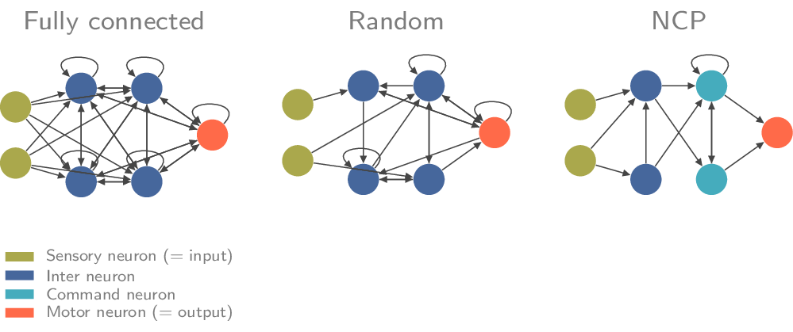
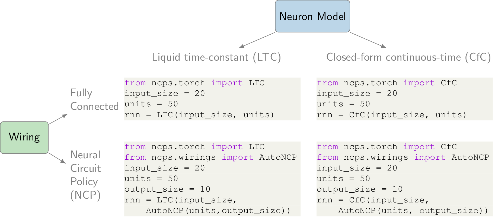

:hide-toc:

===================================================
Quickstart
===================================================

Neural Circuit Policies are recurrent neural network models inspired by the nervous system of the nematode C. elegans.
Compared to standard ML models, NCPs have

#. Neurons that are modeled by an ordinary differential equation
#. A sparse structured wiring

Neuron Models
=============================
The package currently provides two neuron models: LTC and CfC:
The `liquid time-constant (LTC) <https://ojs.aaai.org/index.php/AAAI/article/view/16936/16743>`_ model is based on neurons in the form of differential equations interconnected via sigmoidal synapses.
The term liquid time-constant comes from the property of LTCs that their timing behavior is adaptive to the input (how fast or slow they respond to some stimulus can depend on the specific input).
Because LTCs are ordinary differential equations, their behavior can only be described over time.
LTCs are universal approximators and implement causal dynamical models.
However, the LTC model has one major disadvantage: to compute their output, we need a numerical differential equation-solver which seriously slows down their training and inference time.
Closed-form continuous-time (CfC) models resolve this bottleneck by approximating the closed-form solution of the differential equation.

.. note::
    Both the LTC and the CfC models are **recurrent neural networks** and possess a temporal state. Therefore, these models are applicable only to sequential or time-series data.

Wirings
=============================
We can use both models described above with a fully-connected wiring diagram by simply passing the number of neurons, i.e., as it is done in standard ML models such as LSTMs, GRU, MLPs, and Transformers.

.. code-block:: python

    from ncps.torch import CfC

    # a fully connected CfC network
    rnn = CfC(input_size=20, units=50)

We can also specify sparse structured wirings in the form of a ``ncps.wirings.Wiring`` object.
The `Neural Circuit Policy (NCP) <https://publik.tuwien.ac.at/files/publik_292280.pdf>`_ is the most interesting wiring paradigm provided in this package and comprises of a 4-layer recurrent connection principle of sensory, inter, command, and motor neurons.

The easiest way to create a NCP wiring is via the ``AutoNCP`` class, which requires defining the total number of neurons and the number of motor neurons (= output size).

.. code-block:: python

    from ncps.torch import CfC
    from ncps.wirings import AutoNCP

    wiring = AutoNCP(28, 4) # 28 neurons, 4 outputs
    input_size = 20
    rnn = CfC(input_size, wiring)

Diagram
=============================

